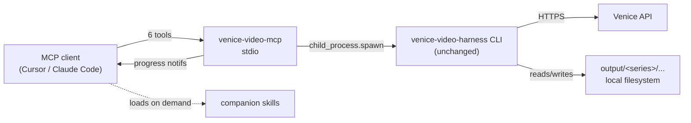

# venice-video-mcp

A token-lean **MCP server** for the [venice-video-harness](https://github.com/jordanurbs/venice-video-harness): consistency-first AI video creation through Venice — series, branded content, narrative, or any multi-shot workflow.

The server exposes **6 verb tools** (~600 always-loaded tokens) instead of 20+ granular ones. Workflow knowledge lives in **3 companion skills** that the agent loads on demand.

> Tracks **venice-video-harness v2.3.x** (2026-05-20 sync): automatic Seedance R2V → Wan 2.7 keyframe pipeline for dialogue shots (CLAUDE.md rule 32; locks character identity into Wan 2.7 i2v's single keyframe and inline-TTS-generates the dialogue MP3 if absent), Seedance scene-level multi-shot default, motion-classified routing (Wan 2.7 lip-sync for low/medium-motion dialogue), per-act music cues with crossfade + new time-varying `gainStops[]`, LUFS audio mix, FCPXML / Premiere xmeml / DaVinci-tuned timeline export, `insert-shot` mid-script, an upfront series-creation questionnaire (`audioStrategy`, `videoFamilyPreference`) that drives model selection + audio routing for the whole series, and the current model families: Seedance 2.0 (+ Fast variant), HappyHorse 1.0, Wan 2.7 (i2v / R2V / Spicy), Wan 2.6 (+ R2V), Runway Gen-4.5, DaVinci MagiHuman (30s lip-sync), PixVerse C1, Kling O3 4K / V3 4K, Grok Imagine (now with R2V), Sora 2 Pro (now 20s + true 1080p), Veo 3.1, LTX Video 2.0, Longcat. The MCP shells out to the harness CLI, so it picks up new harness commits automatically — only the tool surface / schemas / skills need to follow when the harness changes shape.

---

## What this is

The harness is a complete TypeScript CLI for driving Venice's video, image, and audio APIs with character consistency, multi-shot planning, vision-based QA, and ffmpeg assembly. This MCP server is a **thin adapter** that lets MCP-aware clients (Cursor, Claude Code, Claude Desktop) drive that pipeline through natural-language tool calls.

The MCP server **shells out to the harness CLI** — zero coupling, no code duplication. Pull the harness, build it, point the MCP at it, and you're done.



## Tool surface

| Tool | Actions | Long-running? |
|---|---|---|
| `series` | `new`, `list`, `set_aesthetic`, `explore_aesthetic` | no |
| `character` | `add`, `audition_voices`, `lock` | sometimes |
| `episode` | `new`, `workshop`, `approve`, `storyboard`, `qa`, `qa_approve`, `fix_panel`, `insert_shot` | sometimes |
| `media` | `generate_videos`, `override_audio`, `generate_music`, `generate_ambient`, `validate` | **yes** (progress) |
| `assemble` | `assemble`, `produce`, `mix_audio`, `edit_transcribe`, `edit_render`, `edit_timeline`, `export_timeline` | **yes** (progress; `export_timeline` is a fast XML write) |
| `inspect` | `list`, `series`, `episode`, `shot`, `models`, `voices` | no |

For exact per-action arguments see `skills/venice-mcp-cookbook/SKILL.md`.

### What the underlying harness does for you (v2.3.x)

Several behaviours the MCP relied on the agent to orchestrate are now automatic inside the harness:

- **Automatic Seedance R2V → Wan 2.7 keyframe pipeline** (CLAUDE.md rule 32). Every shot the planner routes to Wan 2.7 i2v first renders a Seedance R2V identity-lock pass with all character refs (no audio), extracts frame 1, and uses that frame as the Wan 2.7 `image_url`. Wan 2.7 i2v has no `reference_image_urls`; this is the only reliable way to keep its single keyframe identity-locked. If the dialogue MP3 isn't on disk and the character has a locked voice, the generator inline-TTS-renders it at the canonical `audio/dialogue-shot-NNN.mp3` so the assembler picks it up later — meaning `media.generate_videos` works whether or not `media.override_audio --dialogue` was run first. ~$0.85/shot for matching shots, surfaced in the start-of-run summary. Opt-out: `videoDefaults.seedanceKeyframeForWan: false` (series), `disableSeedanceKeyframe: true` (per shot).
- **Scene-level Seedance multi-shot grouping** of adjacent same-character / same-location shots, so a single Venice generation can cover multiple consecutive shots while keeping identity anchored. Set `mustStaySingle: true` on a shot in `script.json` to opt out.
- **Motion-classified video routing** — shots with `motion: 'low' | 'medium'` and `faceVisible: true` route to `wan-2-7-image-to-video` for lip-sync; high-motion or face-occluded shots stay on the R2V model. `episode.insert_shot` accepts `motion` directly.
- **Per-act music cues with crossfade + per-shot `musicHold` automation** when `script.json` defines a `musicCues[]` array. v2.3.0 wires `gain` through to a real ffmpeg `volume=` filter (was metadata-only before) and adds `gainStops[]` for time-varying gain ("drop -20% at the florida porch shot"). The single-bed `media.generate_music` path still works for episodes that want one uniform mood.
- **LUFS audio mix** — final pass to -16 LUFS integrated / -1 dBTP true peak; SFX trim to ≤2s with a 0.3s fade. Override per-episode via `script.audioMix`.
- **Upfront questionnaire (v2.3.0)** — `series.new` accepts `audioStrategy: 'native' | 'lip-sync' | 'narrator-vo'` and `videoFamilyPreference: 'auto' | 'seedance' | 'happyhorse' | 'grok-imagine' | 'kling-o3'`. Persisted on the series and used at every downstream call: `narrator-vo` auto-sets `audioMix.suppressModelNarration: true` (Seedance is queued with `audio: false` for every dialogue shot, no competing AI narrator) and flips `assemble-episode --dialogue-replace` default to `true` with `--native-volume 0`. The pipeline skill instructs the LLM to ASK these questions before calling `series.new`.
- **Wan 2.7 audio pre-flight** — `audio_url` clips shorter than 3s are auto-padded.
- **Silent-rejection guard (per-resolution thresholds in v2.3.0)** — Venice "200 OK but no output" responses are detected and retried. Threshold scales with the requested resolution (1K → 50 KB, 2K → 150 KB, 4K → 400 KB) instead of a flat 30 KB.
- **Shot-duration preflight (v2.3.0)** — `media.generate_videos` runs `assertShotDurationsValid` before any Venice call and fails fast with an aggregated error listing every shot whose duration violates its routed model's ceiling or stepped ladder (e.g. 16s on Seedance R2V's 15s cap, 8s on Wan 2.7 R2V whose ladder is `[5s, 10s]`).
- **NLE timeline export** — `assemble.export_timeline` writes FCPXML 1.10, Premiere xmeml v5, or a DaVinci-tuned FCPXML using format-specific file extensions so multiple exports can coexist for the same episode.

`inspect.series` and `inspect.episode` surface the relevant fields (`storyboardAspectRatio`, `videoDefaults.lipSyncModel`, `videoDefaults.audioStrategy`, `videoDefaults.videoFamilyPreference`, `videoDefaults.seedanceCompatibility`, `videoDefaults.seedanceKeyframeForWan`, `videoDefaults.imageDefaults`, `musicCueCount`, `audioMix`, `timelineExports[]`) so the agent can plan around them without parsing `series.json` by hand.

## Companion skills

Three Markdown skills are shipped under `skills/`:

- **`venice-mcp-pipeline`** — natural-language → tool-call recipes for the common end-to-end workflows.
- **`venice-mcp-cookbook`** — every action with copy-paste argument examples.
- **`venice-mcp-troubleshooting`** — every known production gotcha (wrong aspect ratio, character drift, Seedance provenance, filler-trim rules) with cause + fix.

Skills load on demand — they cost zero tokens until the agent decides it needs them.

---

## Installation

### 1. Install and build the harness

The MCP shells out to the harness, so you need it built and available.

```bash
git clone https://github.com/jordanurbs/venice-video-harness.git
cd venice-video-harness
npm install
npm run build
npm link            # exposes `venice-video` on PATH
```

Verify:
```bash
venice-video --help
```

### 2. Install and build the MCP server

```bash
git clone https://github.com/jordanurbs/venice-video-mcp.git
cd venice-video-mcp
npm install
npm run build
```

### 3. Install the companion skills

Pick one (or both):

```bash
# Workspace-only (current project's .claude/skills/)
node bin/install-skills.js --workspace ./

# Global (~/.claude/skills/, available in any project)
node bin/install-skills.js --global

# Both
node bin/install-skills.js --workspace ./ --global
```

The installer creates symlinks into the target — running it again is idempotent. Use `--uninstall` to remove the symlinks (the source skills are untouched).

### 4. Configure your MCP client

#### Cursor (`.cursor/mcp.json`)

See `examples/cursor.mcp.json`. Copy into your repo and adjust the absolute paths:

```json
{
  "mcpServers": {
    "venice-video": {
      "command": "node",
      "args": ["/ABS/PATH/TO/venice-video-mcp/bin/venice-video-mcp.js"],
      "env": {
        "VENICE_API_KEY": "vn_...",
        "HARNESS_PATH": "/ABS/PATH/TO/venice-video-harness",
        "HARNESS_WORKSPACE": "/ABS/PATH/TO/venice-video-harness"
      }
    }
  }
}
```

#### Claude Desktop

Same shape, written into `~/Library/Application Support/Claude/claude_desktop_config.json` (macOS) or the equivalent on other OSes. See `examples/claude-desktop.config.json`.

#### Claude Code (CLI)

```bash
claude mcp add venice-video -- node /ABS/PATH/TO/venice-video-mcp/bin/venice-video-mcp.js
# then set env via shell or claude_code config
```

---

## Configuration

The MCP server reads these environment variables:

| Variable | Required | Purpose |
|---|---|---|
| `VENICE_API_KEY` | yes | Venice API auth (forwarded to the harness) |
| `HARNESS_PATH` | recommended | Absolute path to the harness repo (with built `dist/`) |
| `HARNESS_BIN` | optional | Explicit path to a built harness CLI (`dist/mini-drama/cli.js`) |
| `HARNESS_WORKSPACE` | optional | Where the MCP looks for series; defaults to cwd. Resolves project slugs against `<workspace>/output/<slug>/` |
| `VENICE_MCP_UPDATE_CHECK` | optional | Set to `0` / `false` to disable the daily GitHub release check. See [Staying up to date](#staying-up-to-date). |
| `GITHUB_TOKEN` | optional | If set, the update check uses authenticated GitHub API quota instead of the anonymous 60/hr bucket. Read-only `public_repo` scope is enough. |

Resolution order for the harness binary:
1. `HARNESS_BIN` if set and exists.
2. `venice-video` on PATH (i.e. you ran `npm link` in the harness).
3. `HARNESS_PATH/dist/mini-drama/cli.js` if `HARNESS_PATH` is set.

### Where your video projects land

`HARNESS_WORKSPACE` should be a **dedicated directory you own** (e.g. `~/venice-projects/`), **not** the harness repo. All series materialize under `<HARNESS_WORKSPACE>/output/<slug>/` — the `output/` segment is hardcoded by the harness, so `HARNESS_WORKSPACE` controls the *parent* of `output/`, not its replacement. Pre-create the directory; the server refuses to start if it doesn't exist. If `HARNESS_WORKSPACE` is unset, the server falls back to `process.cwd()`, which is rarely what you want for GUI-launched MCP clients.

`ffmpeg` and `ffprobe` must be on PATH (used by `assemble.assemble`, `produce`, `edit_render`, `edit_timeline`).

---

## Staying up to date

Both this MCP and the `venice-video-harness` evolve fast — Venice ships new video, image, and audio models on a near-weekly cadence, and each one comes with its own prompt conventions, aspect-ratio quirks, character-consistency tricks, and provenance gotchas. The harness encodes those techniques (model registry, voice catalog, QA prompts, edit-pipeline rules) and the MCP's skills document them. Running an old install means the agent will literally not know that newer models exist or how to drive them correctly.

To keep that pain manageable without making the project a black box, the server includes a **passive update check**. It is fully transparent — here is exactly what it does, when, and what it sends.

### What runs

On startup the server:

1. Reads a local cache at `~/.venice-video-mcp/update-check.json` (24h TTL on success, 1h on failure). If a fresh result exists, the cached "update available" line is appended to the MCP server's `instructions` field on the `initialize` response, so the agent sees it immediately.
2. After the stdio transport is connected, in the background it makes up to two HTTPS calls:
   - `GET https://api.github.com/repos/jordanurbs/venice-video-mcp/releases/latest`
   - `GET https://api.github.com/repos/jordanurbs/venice-video-harness/releases/latest` (only if `HARNESS_PATH` is set so the harness version is readable from `<HARNESS_PATH>/package.json`)
3. Compares the returned `tag_name` against the local `package.json#version` of each repo (simple semver compare; pre-release tags ignored). Writes the result to the cache file.
4. If anything is behind, sends one `notifications/message` with `level: "info"`, `logger: "venice-video-mcp"`, and a JSON payload of the form:

   ```json
   {
     "kind": "update-available",
     "message": "Update available: venice-video-mcp 0.1.0 → 0.2.0, venice-video-harness 0.3.2 → 0.4.0. Run `venice-video-mcp-update`.",
     "components": [
       { "name": "venice-video-mcp",     "current": "0.1.0", "latest": "0.2.0", "behind": true,  "releaseUrl": "..." },
       { "name": "venice-video-harness", "current": "0.3.2", "latest": "0.4.0", "behind": true,  "releaseUrl": "..." }
     ],
     "checkedAt": "2026-05-11T19:30:00.000Z",
     "docs": "https://github.com/jordanurbs/venice-video-mcp#staying-up-to-date"
   }
   ```

   Cursor and Claude Desktop both surface `notifications/message` in their MCP log panel. The notification only fires when at least one component is actually behind; on a fully up-to-date install nothing is ever sent.

### What it does *not* do

- It never auto-modifies your install. No `git pull`, no `npm install`, no rebuild happens unless you explicitly run `venice-video-mcp-update`.
- It never reports anything *about* you to GitHub. The requests are anonymous public-API GETs (no payload, no telemetry); GitHub's standard rate-limit headers are the only thing they observe. Set `GITHUB_TOKEN` if you want them counted against your authenticated quota instead of the shared 60/hr unauthenticated bucket.
- It writes one file (`~/.venice-video-mcp/update-check.json`) and reads two (`<this-repo>/package.json`, `<HARNESS_PATH>/package.json`). Nothing else on disk is touched by the check.
- All errors are swallowed. Offline, behind a proxy, GitHub API down, no releases tagged yet — the server starts normally and the check just doesn't fire that day.

### Acting on the notification

When you see the notice, run:

```bash
venice-video-mcp-update           # interactive: pulls + builds both repos
venice-video-mcp-update --yes     # non-interactive
venice-video-mcp-update --dry-run # show the plan without executing
venice-video-mcp-update --mcp-only
venice-video-mcp-update --harness-only
```

The updater refuses to run if either working tree has uncommitted changes — it will not clobber local edits. After it finishes, restart your MCP client so the new build is picked up.

### Disabling the check

Set `VENICE_MCP_UPDATE_CHECK=0` (also accepts `false` / `no` / `off`) in the `env` block of your `cursor.mcp.json` / `claude_desktop_config.json`. The startup banner will print `update check disabled` and no network call is ever made.

### Why two repos

The MCP shells out to the harness CLI, so the **harness is the one carrying new model support and consistency techniques**. The MCP itself only changes when a tool surface, schema, or skill needs to follow the harness. In practice the harness ships updates more often, and an out-of-date harness is the more common cause of "this newer Venice model isn't working." That's why the check tracks both and the updater pulls both by default.

---

## Usage

Once configured, talk to your MCP client in natural language. The agent reads the `venice-mcp-pipeline` skill on demand to map your request to tool calls.

> "List my Venice series."
>
> Calls `inspect { action: 'list' }`. Returns the series catalog from `<workspace>/output/`.

> "Make a new series called 'The Audacity' about a sarcastic talk-show host."
>
> Calls `series { action: 'new', name: 'The Audacity', concept: '…' }`, then prompts you for aesthetic.

> "Produce episode 1 of the-audacity."
>
> Calls `assemble { action: 'produce', project: 'the-audacity', episode: 1 }` with progress notifications streaming during the long render.

For more recipes see `skills/venice-mcp-pipeline/SKILL.md`.

---

## Architecture

```text
venice-video-mcp/
├── bin/
│   ├── venice-video-mcp.js          # stdio entry shim (built dist)
│   ├── venice-video-mcp-update.js   # manual updater shim (git pull + build)
│   └── install-skills.js            # skill installer shim
├── src/
│   ├── server.ts                    # registers 6 tools, stdio transport, schedules update check
│   ├── update-check.ts              # GitHub releases poll, 24h cache, semver compare
│   ├── config.ts                    # HARNESS_BIN / HARNESS_PATH resolution
│   ├── harness.ts                   # spawn wrapper, stdout streaming
│   ├── progress.ts                  # parses harness stdout → MCP progress
│   ├── schemas.ts                   # zod discriminated unions + flat shapes
│   ├── responses.ts                 # { ok, paths, message } helpers
│   └── tools/
│       ├── series.ts
│       ├── character.ts
│       ├── episode.ts
│       ├── media.ts
│       ├── assemble.ts              # also wraps the harness's edit-pipeline scripts
│       └── inspect.ts               # reads JSON state directly (no spawn)
├── skills/
│   ├── venice-mcp-pipeline/SKILL.md
│   ├── venice-mcp-cookbook/SKILL.md
│   └── venice-mcp-troubleshooting/SKILL.md
├── scripts/
│   ├── install-skills.ts            # workspace + global symlink installer
│   └── update.ts                    # `venice-video-mcp-update` implementation
└── examples/
    ├── cursor.mcp.json
    └── claude-desktop.config.json
```

### Why a single-file-per-tool, action-discriminated design?

- **Token frugality.** Six tools with one-line descriptions cost ~600 tokens vs ~3K for granular per-command tools. Skills carry the rest of the knowledge on demand.
- **Schema correctness.** Each tool's input is a flat `z.object` with action enum + optional fields, so MCP clients see real JSON Schema (not empty objects). Internal validation runs through zod discriminated unions for full type safety.
- **No coupling to harness internals.** Adding a new harness CLI command? Add a `case` in the right tool, an action to the schema, and a cookbook example. No SDK refactor, no harness changes.

### Why shell out instead of importing harness modules?

- The harness is a normal CLI app, not a library. Re-exposing every internal function as a public API would be a meaningful breaking change.
- Spawning means the MCP picks up harness fixes automatically (`git pull` in the harness repo, that's it).
- Per-call overhead is ~50ms — negligible against multi-minute Venice generation calls.

---

## Development

```bash
npm run dev          # tsx watch mode against src/server.ts
npm run build        # tsc → dist/
npm test             # (TODO)
```

Manual smoke test of the stdio protocol:

```bash
cat <<'EOF' | HARNESS_PATH=/abs/harness HARNESS_WORKSPACE=/abs/harness node bin/venice-video-mcp.js | python3 -m json.tool
{"jsonrpc":"2.0","id":1,"method":"initialize","params":{"protocolVersion":"2024-11-05","capabilities":{},"clientInfo":{"name":"smoke","version":"0"}}}
{"jsonrpc":"2.0","method":"notifications/initialized"}
{"jsonrpc":"2.0","id":2,"method":"tools/list"}
{"jsonrpc":"2.0","id":3,"method":"tools/call","params":{"name":"inspect","arguments":{"action":"list"}}}
EOF
```

---

## License

MIT. See [LICENSE](LICENSE).

## See also

- **The harness:** [venice-video-harness](https://github.com/jordanurbs/venice-video-harness)
- **MCP spec:** [modelcontextprotocol.io](https://modelcontextprotocol.io)
- **Venice API:** [venice.ai](https://venice.ai)
