# venice-mcp-pipeline

This skill is the workflow brain for the **venice-video-mcp** server. It tells you which of the six tools to call, in what order, for the most common requests.

> **Companion: `venice-mcp-directing`.** This skill decides *which tool* and *in what order*. Its sibling **venice-mcp-directing** decides *what the creative content says* --- the concept, per-shot prompts, dialogue delivery, retakes, and continuity --- by bridging the Seedance 2.0 Skill OS (the "direct the scene, don't decorate it" engine) onto these fields. Load it whenever you are authoring or improving content, not just orchestrating. The seam-specific pointers below tell you exactly when.

## STEP 0 — Upfront questionnaire (ask BEFORE `series.new`)

A 30-second conversation at series-creation time eliminates an entire class of expensive bugs. **Always ask these two questions before calling `series.new`**, unless the user has already volunteered the answers. Persist them via the new `audioStrategy` and `videoFamilyPreference` fields on `series.new`.

### Question 1 — How does dialogue reach the final mix?

Ask the user:

> "How will characters talk in this episode?
>   - **(a) Native dialogue** (recommended) — Seedance generates the speech in-frame. Each character gets a short voice-reference clip so their voice stays the same across shots, but the line itself is model-generated.
>   - **(b) Exact lip-sync** — Venice TTS renders each line and Wan 2.7 drives the character's mouth from that exact recording. Pick this only when the delivery has to match a specific take: a cloned or branded voice, a scripted read, a localized dub.
>   - **(c) Narrator voice-over** — a single narrator speaks over the visuals; no character mouths move. (Nature documentaries, mock-Audubon, true-crime-style)."

Map their answer to `series.new audioStrategy`:
- (a) → `audioStrategy: 'native'`
- (b) → `audioStrategy: 'lip-sync'`
- (c) → `audioStrategy: 'narrator-vo'`

**Do not conflate the two audio-reference paths.** Native sends a *voice-donor* clip (`reference_audio_urls` / `@AudioN`) that locks timbre, accent, and pacing while Seedance still generates the dialogue — it is not deterministic against a supplied recording. Only lip-sync sends the exact speech file (`audio_url`) that drives the mouth. Never describe the donor clip as "the dialogue audio file."

What this controls automatically:
- `'native'` keeps `assemble.assemble dialogueReplace: false`, lets Seedance speak, and keeps every dialogue shot on R2V (full reference stack, native multi-shot bundling still allowed).
- `'lip-sync'` flips `assemble.assemble dialogueReplace` default to `true` (Venice TTS) and is the **only** strategy that routes face-visible low/medium-motion single-speaker dialogue shots through Wan 2.7. Character `voiceDesc` becomes the TTS voice spec, not just a hint to Seedance. Those shots render as singles and cost roughly double (Seedance keyframe pass + Wan render), so don't select it by default.
- `'narrator-vo'` sets `audioMix.suppressModelNarration: true` so Seedance is queued with `audio: false` on every dialogue shot (no competing AI narrator); flips `dialogueReplace` default to `true` and `nativeVolume` default to `0`. This is the configuration that would have prevented every double-narration version of the PNW field-guide.

### Question 2 — Which video model family?

Ask the user:

> "Which video model family fits the look you want?
>   - **(a) Seedance 2.0** (default) — strong R2V identity anchoring, 4-15s native durations, mature audio generation, photoreal-leaning. The `seedance-2-0-fast-*` variants are cheaper / quicker for the same family.
>   - **(b) MiniMax H3** — the open-weight omni-modal model (added 2026-07-31). Every render is 2K with native stereo audio, at roughly a third the per-second cost of the other families, and R2V takes the same 9-image reference stack as Seedance. Two constraints to plan around: 2K is the *only* resolution, so there is no cheap draft tier and every take is a finish-quality spend; and the duration ladder starts at 5s, so any 3-4s beat has to be re-scripted or routed to another family.
>   - **(c) MiniMax H3 Max** — related to MiniMax H3 in name only, and the montage family. It renders 768P (2K is rejected), it is private rather than anonymized, and it wants a PLAIN prompt: one or two sentences of intent, because it stages its own framing, coverage, and cutting. Over-directing it flattens the result, so the harness automatically strips blocking, locked location descriptions, and geography-hold clauses from its prompts. 5-15s ladder, $0.024/s. Pick it when you want to describe a sequence and let the model tell it.
>   - **(d) MiniMax H3 Max Turbo** — the same model at $0.012/s, the cheapest lane available, which makes 15s takes cheap enough to render several and pick. No R2V lane, so character-identity shots cross to the H3 Max R2V.
>   - **(e) HappyHorse 1.1** — Alibaba's #1 blind-preference model (T2V + I2V). Joint single-pass video+audio with phoneme-level lip-sync in 7 languages (EN, Mandarin, Cantonese, JA, KO, DE, FR), and R2V with up to 9 reference images. Best for talking characters and multilingual localization; SFW/commercial-leaning (for mature work prefer Seedance or Wan). The `happyhorse` family routes here.
>   - **(f) Grok Imagine** — atmosphere-rich, in-family R2V (added 2026-05). R2V durations are stepped at 5s / 8s / 10s only; the duration preflight will catch any shot scripted outside that ladder.
>   - **(g) Kling O3** — best for stylized, illustrated, anime, or non-photoreal aesthetics. Accepts non-seedream input images.
>   - **(?) Not sure** — pick `auto` and decide later."

Map their answer to `series.new videoFamilyPreference`:
- (a) → `'seedance'` (or omit / `'auto'`)
- (b) → `'minimax-h3'`
- (c) → `'minimax-h3-max'`
- (d) → `'minimax-h3-max-turbo'`
- (e) → `'happyhorse'`
- (f) → `'grok-imagine'`
- (g) → `'kling-o3'`
- (?) → `'auto'`

If they pick MiniMax H3, two things to plan for. Write the beat script on a 5-15s grid from the start — the duration preflight rejects sub-5s shots before anything is queued, but catching it at script time saves a rewrite. And keep the storyboard blocking plate in the reference stack for every shot: H3 R2V weighs reference aspect when deciding output orientation, so a character-only stack of 1:1 sheets can come back non-16:9 even with `aspect_ratio: '16:9'` set. Check the first-frame contact sheet before assembling.

This swaps the series's default `actionModel` / `atmosphereModel` / `characterConsistencyModel`, and picks `lipSyncModel` — which goes unused unless Q1 was answered `lip-sync`. Families whose own R2V lane accepts a top-level `audio_url` stay in-family for it (Seedance, MiniMax H3, and both MiniMax H3 Max families, all on their R2V lane); everything else falls back to Wan 2.7 i2v, which forfeits reference anchoring.

**Other families in the registry** that the questionnaire intentionally doesn't expose (override via direct edit of `series.json videoDefaults` if needed):

- `runway-gen4-5` / `runway-gen4-turbo` / `runway-gen4-aleph` — Runway Gen-4.5 family. Strong motion physics, 7 aspect ratios, but silent (no audio, not configurable) and no R2V. Pick for music videos / atmosphere reels where dialogue isn't a factor.
- `davinci-magihuman-image-to-video` — talking-head specialist, 5-30s lip-sync via `audio_url`. Longer max duration than Wan 2.7 (30s vs 15s), but 16:9 only. Consider as an alternative `lipSyncModel` for documentary / interview formats.
- `sora-2-pro-image-to-video` — now 20s + `true_1080p` (refreshed 2026-05). Pick when delivery quality matters more than R2V identity locking (Sora has no R2V).
- `pixverse-c1-*` — new PixVerse C1 line. Replaces v5.6 for new projects: same four resolutions but 15s ladder + new R2V variant.
- `kling-v3-4k-*` — 4K variants of the Kling V3 family.
- `wan-2-7-spicy-image-to-video` — uncensored Wan 2.7 i2v variant.
- `wan-2.6-reference-to-video` — Wan 2.6 R2V (10s max), accepts `audio_url` input.

### Question 3 (optional, only when uncertain) — Aspect ratio

If the user hasn't told you the platform / aspect ratio, ask whether the episode is **16:9 (widescreen / YouTube / cinema)**, **9:16 (TikTok / Reels / Shorts)**, or **1:1 (Instagram feed)**. Persist via `series.set_aesthetic` (set `storyboardAspectRatio` in `series.json` separately). The harness defaults to 9:16 if nothing is set, which is wrong for most narrative work.

### When to skip the questionnaire

- The user has already specified both answers in the same message.
- The user is iterating on an existing series and explicitly says "use the existing config".
- The user opts out ("just pick reasonable defaults"). In that case use `audioStrategy: 'native'` and `videoFamilyPreference: 'auto'` — and **say** that's what you're doing.

If the user only answers one of the two, ask the other before proceeding. Don't guess.

### Directing note for STEP 0

If the idea is still vague at series/episode-creation time, run the Seedance OS `seedance-interview` (short form for a fast brief) before you draft anything --- see **venice-mcp-directing**. For a longer or multi-clip story, run `seedance-sequence` to establish the story spine and **one directorial voice** you will hold across shots and episodes. Fold that into the `episode.workshop` concept later; it costs nothing here and prevents a generic, decorated script.

## The 7 tools (always-loaded surface)

| Tool | Actions | Long-running? |
|---|---|---|
| `series` | `new`, `list`, `set_aesthetic`, `explore_aesthetic` | no |
| `character` | `add`, `audition_voices`, `lock`, `generate_voice_reference` | sometimes (image gen / audio gen) |
| `location` | `add`, `generate_references`, `list` | sometimes (image gen) |
| `episode` | `new`, `workshop`, `approve`, `storyboard`, `qa`, `qa_approve`, `fix_panel`, `insert_shot` | sometimes (storyboard, qa) |
| `media` | `generate_videos`, `override_audio`, `generate_music`, `generate_ambient`, `validate`, `loop` | **yes** (`loop` returns fast, then runs in the background) |
| `assemble` | `assemble`, `produce`, `mix_audio`, `edit_transcribe`, `edit_render`, `edit_timeline`, `export_timeline` | **yes** (except `export_timeline`, which is cheap XML write) |
| `inspect` | `list`, `series`, `episode`, `shot`, `models`, `voices` | no |

**Locations** are first-class environments with generated reference images (wide / medium / detail). Tag shots with `location: <slug>` and the harness folds the location ref into panels and video (Kling → `scene_image_urls`; Seedance / HappyHorse → `reference_image_urls` + an `@ImageN` env tag). `episode.workshop` auto-defines locations, tags every shot, and generates any missing refs after saving the draft — so you usually don't call the `location` tool by hand unless you want an explicit place before workshopping, or to regenerate a ref.

**Voice references** keep a character's voice consistent across shots. On dialogue shots that route to a reference-audio model (Seedance 2.0 R2V family, HappyHorse 1.1 R2V), the harness attaches the speaker's `characters/<slug>/voice-reference.mp3` as `reference_audio_urls` (bound in-prompt as `@AudioN`), auto-generating it from `voiceDescription` on first use. Pre-bake or import a real recording with `character.generate_voice_reference` / `character.lock { voiceReference }`. Disable per-run with the harness `--no-voice-reference` or series-wide `videoDefaults.voiceReferenceForDialogue: false`.

For full per-action argument shapes see the **venice-mcp-cookbook** skill.
For failures, gotchas, and anti-patterns see **venice-mcp-troubleshooting**.

## What the underlying harness now does for you (v2.3.x)

Several behaviours the MCP relied on the agent to orchestrate are now automatic inside the harness. You don't have to script them — but you should know they're running so you can interpret stdout:

- **Seedance scene-level multi-shot.** When adjacent shots share the same characters and location, the harness now plans them as a single Seedance multi-shot generation by default. You won't see "shot 5 of 12" — you'll see "unit 3 of 8 (covers shots 5-6)". This is fine; identity stays anchored across the unit.
- **Motion-classified video routing.** Each shot's `motion` field (`low | medium | high`) drives the planner **when the series runs `audioStrategy: 'lip-sync'`**: low/medium-motion dialogue shots with a visible face route to `wan-2-7-image-to-video`, while high-motion or face-occluded shots stay on the R2V model. Under `native` or `narrator-vo`, dialogue shots never leave the R2V model no matter their motion. `episode.insert_shot` lets you set `motion` directly. To change motion on an existing shot, edit `script.json`. **Automatic identity lock (harness ≥ 2.2.0):** Wan 2.7 i2v has no `reference_image_urls`, so its single keyframe is its only identity anchor. `media.generate_videos` now auto-renders a Seedance R2V identity-lock pass first, extracts frame 1, and uses it as the Wan 2.7 keyframe + the dialogue MP3 (auto-TTS-generated if missing) as `audio_url`. ~$0.85/shot for matching shots, reported in the start-of-run summary. See troubleshooting **A27** for opt-out levers (`videoDefaults.seedanceKeyframeForWan: false` series-wide, `disableSeedanceKeyframe: true` per shot).
- **Per-act music cues with crossfade.** If the episode script has a `musicCues[]` array (manually authored or via `episode.workshop` for series that opt in), `assemble.assemble` / `produce` will render and crossfade them automatically. The single-bed `media.generate_music` path still works — when both exist, the cues win.
- **LUFS audio mix.** The assembler now runs a final-pass to -16 LUFS integrated / -1 dBTP true peak by default. SFX clips are trimmed to ≤2s with a 0.3s fade-out. Episode-level overrides go in `script.audioMix`.
- **Wan 2.7 audio pre-flight.** When a shot's `audioUrl` is shorter than 3 seconds, the harness pads it to 3s automatically (Wan 2.7 returns 400 otherwise). You'll see a "padded audio_url N.NNs -> 3.00s" line in stdout.
- **Silent-rejection guard.** Every Venice response is checked for the "no output produced" pattern that occasionally slips past a 200 OK. The harness retries up to 3 times and surfaces a structured error instead of returning a zero-byte file.
- **No-overlap spoken-audio scheduling.** The assembler must schedule narrator and character dialogue with one global cursor, based on measured `ffprobe` durations rather than planned shot lengths. Long VO should extend/hold the picture or be shortened/split; it should never bleed into the next shot's line.
- **Per-shot continuity re-anchoring.** For separately rendered shots, reuse the same canonical refs and restate invariant traits in every prompt, especially relative size and any in-story state change. Prefer Seedance native multi-shot for consecutive beats when it fits.

## Shot duration strategy — prefer 15s, stitch fewer long clips

**Default to 15-second shots.** Seedance 2.0 and HappyHorse 1.0 both accept any integer 3–15s natively, and 15s is the maximum. Wan 2.7 also generates at long durations. For a 30-second beat, **2x15s beats 5x6s**, and it's not even close:

- **Identity stays locked longer.** Each new shot is a fresh R2V/i2v generation; the more transitions, the more places character likeness can drift.
- **Cost is lower.** Per-shot Venice billing is a fixed setup plus a per-second component; fewer shots = lower total.
- **Motion has room to breathe.** Many of the "AI video looks twitchy" tells come from cutting before a gesture/expression has time to complete.
- **Fewer panel renders.** Every shot needs a storyboard panel; halving shot count halves the storyboard cost too.
- **Fewer transitions to hand-edit.** A 5-shot version has 4 cut points to police for continuity; a 2-shot version has 1.

Only drop below 15s for **deliberate** short beats: a hard cut, a 1-second sight gag, a reaction stinger. Default everything else to 15s.

When you call `episode.workshop`, include this guidance in the `concept` (the harness's script LLM defaults to short shots otherwise). When you call `episode.insert_shot`, **omit `duration` to take the new 15s default** rather than passing a smaller value out of habit.

You can verify after the fact via `inspect.episode` (returns `shotCount`) and by reading `script.json` — if a 30s episode has 5+ shots, the workshop produced too many beats.

## Voice strategy — native dialogue, post-production music & SFX

Venice's TTS voices (Kokoro, Qwen3) are usable but limited in range and emotion. Until Venice ships better voice options, the recommended pipeline is:

1. **Let the video gen model speak the dialogue.** Seedance 2.0, Wan 2.7, and HappyHorse 1.0 all generate in-character audio when the panel prompt includes a detailed voice/delivery description. Quality is highly prompt-dependent; spec it precisely (timbre, accent, pacing, emotional register, idiolect, breath placement).
2. **Suppress the model from adding music or SFX.** Include negatives like "no background music, no sound effects, no soundtrack, dry recording" in every dialogue shot's prompt. The harness adds music (`musicCues[]` or `media.generate_music`) and ambient/SFX (`media.generate_ambient`, `assemble.mix_audio`) in post.
3. **Keep `dialogueReplace: false` on `assemble.assemble`.** This is the default. The native dialogue track plays at full volume (`nativeVolume` resolves to 1.0), with music and ambient mixed underneath.
4. **Use `media.override_audio { dialogue: true }` only as a deliberate corrective** — accent control, language swap, NARRATOR voice-over, or when the model botched a specific take. Default to NOT replacing dialogue.

### Narrator / voice-over episodes (`dialogueReplace: true` paths)

Documentary-style episodes with a NARRATOR character driving most shots are the main exception. For these:

- Harness ≥ 2.3.0 auto-passes `audio: false` to Seedance for every shot whose dialogue character is `NARRATOR` (or whenever `script.audioMix.suppressModelNarration: true` is set). Seedance i2v aggressively generates a competing English narrator whenever the prompt mentions `narrator` / `documentary` / `naturalist`; this stops it from happening at the source.
- Run `media.override_audio { dialogue: true }` to render Venice TTS for every shot's dialogue line, then `assemble.assemble { dialogueReplace: true }`. `nativeVolume` resolves to 0 automatically — no need to pass it.
- For shots that DO have real ambient audio worth preserving (paper rustle, room tone, faint rain, foley) while the narrator's voice is muted everywhere else: set `shot.nativeAudio: 'keep'` on those shots in `script.json` to override the global mute. `'duck'` keeps the ambient at 20%; `'mute'` is the default for NARRATOR shots and is explicit-equivalent to the auto behaviour.

What this means for `character.add`: the `voiceDesc` field is now the primary lever for dialogue quality. Spec it like you're directing a voice actor — see the cookbook's `character.add` example. The Venice voice you `character.lock` is the fallback for Venice TTS only; it doesn't affect the native model dialogue.

What this means for `episode.workshop`: instruct the script LLM to include per-shot voice direction in dialogue beats (delivery, subtext, energy) AND to add the no-music/no-SFX negative to every shot prompt.

## Reading harness output — warnings surface even on success

The MCP's `fromHarness` wrapper now extracts known warning patterns from harness stdout/stderr and surfaces them in the response — even when the harness exited 0. When a tool returns `ok: true` but `warnings: [...]` is non-empty, **read the warnings before assuming the output is clean**. Common ones:

- `silent rejection detected, retry N/3` — Venice returned 200 OK with no actual output; the harness retried. If you see the final retry succeed, the output is real; if you see `silent rejection persisted after 3 retries`, the upstream model is degraded.
- `duration auto-snapped` — the requested shot duration wasn't in the model's allowed set and was rounded. With the new 15s default this should stop happening, but if it does, the script has a stale duration.
- `padded audio_url N.NNs -> 3.00s` — Wan 2.7 audio pre-flight padded a sub-3s dialogue clip.
- `falling back to panel-anchored single-pass render` — Wan 2.7 keyframe pipeline (rule A27) failed and fell back. Identity may drift on that shot; consider `disableSeedanceKeyframe: false` + retry, or accept the drift.
- `deprecation` / `x-venice-model-deprecation-warning` — Venice flagged a deprecated model; migrate before the sunset date.

A successful run with warnings reads like: `"<original message> (with N warnings — see warnings[])"`. The response also includes a short `stderrTail` so you have context.

## Mental model

```mermaid
flowchart LR
    A[series.new] --> B[series.set_aesthetic]
    B --> C[character.add]
    C --> D[character.audition_voices]
    D --> E[character.lock]
    E --> F[episode.new]
    F --> G[episode.workshop]
    G --> H[episode.approve]
    H --> I[episode.storyboard]
    I --> J[episode.qa]
    J -->|good| K[episode.qa_approve]
    J -->|bad shot| L[episode.fix_panel]
    L --> J
    K --> M[media.generate_videos]
    M --> N[media.generate_music]
    N --> O[assemble.assemble]
    O --> P[final mp4]
```

The MCP shells out to the Venice Video Harness CLI. State lives on the local filesystem under the workspace's `output/<series-slug>/` directory. You're orchestrating a multi-stage creative pipeline:

`assemble.produce` is a one-shot path that runs `media.generate_videos` -> `media.generate_music` -> `assemble.assemble` in sequence. Use `produce` only when the user explicitly says "do everything," and never before QA approval.

**Loop mode branches off the shot script (gate-skipping).** The chart above is the gated production path. There is one alternate entry point that is NOT a step in it: once `episode.workshop` has produced a shot script, `media.loop` renders the whole plan continuously into a live browser loop, skipping storyboard/QA and writing only under `loop/`. It is not on the way to the final cut — it's for watching the plan move or cheaply gathering takes. See Recipe 3d. (The `episode.storyboard`/`qa`/`generate_videos`/`assemble` chain is still the only route to the canonical `episode-NNN-final.mp4`.)

## Recipes

### Recipe 1: New series from scratch
The user says: "Make a new series about X."

1. `series.new { name, concept, genre?, setting? }` --- creates the series directory.
2. `series.set_aesthetic { project, style, palette, lighting, lens?, film? }` --- locks the visual rule. Required before any image generation.
3. (Optional) `series.explore_aesthetic { project, count: 5 }` --- only if the user is undecided about aesthetic direction.

Stop here. Confirm with the user before adding characters.

### Recipe 2: Add and lock a character
The user says: "Add character Vivienne to the series."

1. `character.add { project, name, gender, age?, description?, wardrobe?, voiceDesc?, baseTraits?, skipImages? }`
   - This generates 4-angle reference images by default (front, profile, three-quarter, full-body).
   - For non-human characters set `baseTraits` (see venice-mcp-cookbook example).
2. `character.audition_voices { project, character, count: 5, sampleText? }` --- generates Venice TTS samples.
3. After the user picks a voice: `character.lock { project, character, voiceId, voiceName? }`.

A character must be added AND locked before generating an episode that uses them.

### Recipe 3: Workshop, storyboard, QA, generate
The user says: "Make episode 3 about Y."

1. `episode.new { project, title }` --- scaffolds the episode dir + empty script.json.
2. `episode.workshop { project, episode, concept, model? }` --- LLM-drafts a shot-by-shot script. **Direct the concept first** (see **venice-mcp-directing**): fold in the `seedance-interview`/`seedance-sequence` spine and name one intention per beat so the draft comes back directed, not decorated. The harness's in-code workshop prompt already carries the "direct, don't decorate" instruction, but a directed `concept` string is what makes it land.
3. Stop and let the user review/edit `script.json` directly. **Before approving, read each shot `description` through the `directing-engine` lens** (one intention -> coherent camera/light/blocking/performance/sound) and run `seedance-antislop` + `vocab/*` to strip empty "cinematic" boosters. Confirm every `description` still ends with the no-music/no-SFX negative. Then:
4. `episode.approve { project, episode, notes? }`.
5. `episode.storyboard { project, episode, refine: true, editModel?, force? }` --- generates panels (slow, supports progress notifications).
6. `episode.qa { project, episode, model?, shots? }` --- vision-based consistency check.
7. For each flagged shot: `episode.fix_panel { project, episode, shot, characters?, prompt? }`. Re-run QA after. **Run this loop through the Seedance OS `retake-protocol`** (see venice-mcp-directing): triage the verdict, change **one variable** per fix, and keep an attempt budget instead of regenerating blindly.
8. `episode.qa_approve { project, episode, notes? }`.
9. `media.generate_videos { project, episode }` --- LONG. Stream progress. **Before this expensive step, run `seedance-copyright`** over the cast/props/references and rewrite any protected IP, real person, brand, logo, or song into a safe creative equivalent --- this is the hard-to-undo step.
10. (Optional) `media.generate_music { project, episode, prompt?, duration? }` --- only needed if the script has no `musicCues[]`; per-act cues render automatically during assembly.
11. `assemble.assemble { project, episode, ... }` --- final mp4 with subtitles + music + ambient bed, mixed to -16 LUFS.

If the user said "just produce it from approved script" jump from step 8 to `assemble.produce` instead of running 9-11 separately.

### Recipe 3b: Add a beat to an already-rendered episode
The user says: "Insert a reaction shot after shot 5 of episode 3."

**Direct the new beat from accepted footage, not the original plan.** Use the Seedance OS `continuation-handoff` / `sequence-project-state` model (see **venice-mcp-directing**): the episode's already-rendered shots are the source of truth, so write the inserted shot's `description` to flow from the *observed* final state of the shot it follows, holding the same directorial voice.

1. `episode.insert_shot { project, episode, after: "5", description, shotType?, duration?, motion?, characters?, dialogue?, speaker?, transition? }` --- assigns a suffix id like `5b` so existing shot numbers (and their already-rendered panels/clips) stay stable.
2. `episode.storyboard { project, episode, force: false }` --- only the new shot's panel is generated; existing panels are left in place.
3. `episode.qa { project, episode, shots: "5b" }` then `episode.qa_approve` after fixes.
4. `media.generate_videos { project, episode }` --- generates the missing clip only; existing clips are kept.
5. `assemble.assemble { project, episode, ... }` --- re-stitches with the new shot in place.

### Recipe 3c: Finish / polish a harness shot (recipe sidecars)
The user says: "Polish shot 7," "make shot 7 less gritty," or "regenerate shot 7 so it matches the episode."

Harness ≥ 2.4.0 writes a `shot-NNN.recipe.json` sidecar next to every generated asset (panels, character refs, videos): an append-only log where each entry is a replayable Venice call — kind (`generate` / `multi-edit` / `video-generate` / `mechanical`), role (`content` / `identity` / `look` / `mechanical`), model, prompt, negative, seed, cfg, and reference-image paths. **All finishing is done with AI model calls, never local pixel edits.**

1. `inspect.shot { project, episode, shot }` — the file list includes `shot-NNN.recipe.json`. Read it to see every pass that produced the current pixels.
2. Decide by role what to touch:
   - **look** passes (style match, grade, polish) — freely redoable; re-edit with the same edit model family.
   - **identity** passes (character refine, R2V refs, seeds) — never disturb these during a look polish. (The old rule that face-bearing panels must stay in the seedream edit family was removed 2026-07 — Seedance now accepts any image family.)
   - **content** passes — redoing one invalidates everything after it in the chain; replay the later passes too.
3. To make a NEW shot match the episode, replay the recipe scaffolding of a good shot: same `STYLE:` string, seed, cfg, character ref paths, and the scene's `.style-anchor.png` (kept on disk for exactly this).
4. Any finishing pass must be appended to the recipe via the harness's `appendRecipePass()` (`src/venice/recipe.ts`) so the sidecar and provenance stay honest for the next agent.

### Recipe 3d: Loop mode — watch the plan render, or gather usable takes
The user says: "let me watch the loop while it renders," "just loop episode 2 so I can riff on it," or "loop episode 2 in production mode to gather good takes."

Loop mode is a **gate-skipping alternate path**, not a step in the linear pipeline. The moment a shot script exists (`episode.workshop` has run — approval and QA are NOT required), `media.loop` renders the whole plan continuously and serves a **live browser loop** that hot-swaps each shot in as its take finishes and keeps regenerating fresh takes. It writes only under `episodes/episode-NNN/loop/` and never touches the canonical cut or `series.json`, so it can run alongside production.

1. Confirm a shot script exists (`inspect.episode` → `shotCount > 0`). No approval/QA needed.
2. **Ask the user the one required decision — it is never defaulted:** is this for **looping** (creative flow, lower quality — Turbo @480P, t2v then i2v last-frame chaining, identity NOT locked; a disposable draft) or **production** (gather usable shots, higher quality — Max R2V @768P with the full reference stack + voice-donor audio, identity locked)? This is a real quality-vs-flow tradeoff, so make the user communicate it (mirrors the CLI, which errors non-interactively without `--mode`).
3. `media.loop { project, episode, mode: 'looping' | 'production' }` — plus optional `budget` (USD spend cap, default 2), `duration`, `resolution`, `maxTakes`, `chain`, `once`, `unbounded`, `port`.
4. The call returns **fast** with `{ url, pid }` and leaves the web server running in the background. Give the user the `url` to open. It is money-capped by `budget`; the server stops when the MCP session ends, or the user can `kill <pid>`.

Loop mode is the answer whenever the user wants to *see the plan move* before committing to the gated render — or to cheaply generate several takes per shot and pin the keepers — rather than running `media.generate_videos` straight through storyboard + QA.

### Recipe 4: Generate ambient beds + run the script-aware mixer
The user says: "Add a rain bed to episode 2 and re-mix it." or "Mix this episode with ambient layering instead of the basic assembler."

Ambient beds and the script-aware mixer are an alternative to the plain `assemble.assemble` path:

1. Confirm via `inspect.episode { project, episode }` that the episode is QA-approved and `media.generate_videos` has produced clips. Inspect also reports the `ambientLayers[]` already on disk.
2. For each layer you want, call `media.generate_ambient { project, episode, layer, prompt, duration? }`. Pick `layer` from `rain-heavy | rain | crowd | quiet-night`; the filename / discovery layer is fixed to those four.
3. (Optional) `media.generate_music { project, episode, prompt?, duration? }` — or rely on `script.musicCues[]` if defined.
4. `assemble.mix_audio { project, episode }` — script-aware per-shot mix. Writes `episode-NNN-final-nosubs.mp4` then burns subtitles to `episode-NNN-final.mp4` if `subtitles.srt` exists. This **replaces** `assemble.assemble` for the episode (same output filename).

Use `assemble.assemble` for the simple, deterministic path; use `assemble.mix_audio` when you've authored ambient beds and want the harness to vary the mix per shot (e.g. dialogue shots get less ambient, action shots get more, fades at scene boundaries).

### Recipe 5: Hand off to a non-linear editor (FCP X / Premiere / DaVinci)
The user says: "Open episode 2 in [Resolve | Premiere | Final Cut]."

After `media.generate_videos` has produced clips:

1. `assemble.export_timeline { project, episode, format: 'fcpxml' | 'premiere' | 'davinci', fps?, width?, height? }`
2. Tell the user the output path. The extension makes the target editor unambiguous:
   - `fcpxml`   → `episode-NNN.fcpxml`         (Final Cut Pro X — File ▸ Import ▸ XML…)
   - `premiere` → `episode-NNN.premiere.xml`   (Premiere Pro — File ▸ Import…)
   - `davinci`  → `episode-NNN.resolve.fcpxml` (DaVinci Resolve — File ▸ Import ▸ Timeline…)
3. You can export multiple formats from the same episode — they coexist on disk because of the format-specific extensions.

### Recipe 4: Edit existing footage (no Venice generation)
The user says: "Cut down this footage / trim filler words / re-cut this episode."

This path does NOT use the harness's series/episode model. It operates on raw media files.

1. `assemble.edit_transcribe { dir, out, model?, language?, alignedFrom? }` --- writes `takes_packed.md` (text transcript, the primary editing surface) and per-source `*.words.json` files.
2. **READ the takes_packed.md and propose a cut strategy in plain text. STOP and wait for user confirmation.** Never render without approval (anti-pattern A15 in troubleshooting).
3. The actual EDL build + ffmpeg cut is outside the MCP surface today --- the agent invokes the harness's editing library directly via tsx (see `.claude/commands/edit-footage.md` in the harness for the playbook).
4. After the cut lands: `assemble.edit_render { manifest, font?, skipArchive?, dryRun? }` --- composites overlays from a manifest JSON.
5. `assemble.edit_timeline { video, start, end, out, ... }` --- generates a single PNG (filmstrip + waveform + word labels) for visual decisions during cut review.

**Read .claude/skills/video-editing/SKILL.md and .claude/commands/edit-footage.md from the harness repo before driving an edit.** They define the EDL format, the ask-confirm-execute-self-eval loop, and the filler-word handling rules.

## State discovery

When you need to know what exists before acting, use `inspect`:
- `inspect { action: 'list' }` --- enumerate all series in the workspace
- `inspect { action: 'series', project }` --- read series.json (aesthetic, characters, episode list, `videoDefaults` incl. `lipSyncModel` / `seedanceCompatibility` / `imageDefaults`, `storyboardAspectRatio`)
- `inspect { action: 'episode', project, episode }` --- script versions, approval state, final video path, shot count, `musicCueCount`, `audioMix` flag, `ambientLayers[]` (rain-heavy / rain / crowd / quiet-night on disk), `hasMusic`, `timelineExports[]` (FCPXML/Premiere/DaVinci files on disk)
- `inspect { action: 'shot', project, episode, shot }` --- list shot-NNN.* files
- `inspect { action: 'models', category? }` --- model registry from the harness (includes the v2.1 additions: Wan 2.7, Kling O3 4K, HappyHorse 1.0, GPT Image 2)
- `inspect { action: 'voices', provider? }` --- TTS voice catalog

`inspect` is cheap (no spawn). Call it freely before mutating tools.

## Long-running operations and progress

`media.generate_videos`, `media.generate_music`, `assemble.assemble`, `assemble.produce`, and `assemble.edit_render` can take many minutes. The MCP server emits `notifications/progress` for each. If you set a `progressToken` in the request `_meta`, you'll receive unit/shot N-of-M, ffmpeg time codes, and queue/poll status updates.

Heads-up on stdout patterns the harness emits in v2.1.x that you should NOT mistake for failures:

- `unit X of Y (covers shots A-B)` — scene-level multi-shot generation; one Venice call covers multiple consecutive shots.
- `padded audio_url N.NNs -> 3.00s` — Wan 2.7 audio pre-flight padded a short clip.
- `routing shot N to wan-2-7-image-to-video` — the series is on `audioStrategy: 'lip-sync'` and the motion classifier picked the exact-lip-sync model for that shot. Seeing this on a `native` series is a bug.
- `LUFS final pass: integrated -X.X / true-peak -Y.Y` — assembler is normalising to -16 LUFS.

Don't poll `inspect` during a long-running call --- you already get progress notifications.

## When to use `produce` vs explicit steps

Prefer explicit steps unless the user is in "just do it all" mode. Explicit gives you:
- A QA gate before video generation (which is the most expensive step).
- The chance to override audio (`media.override_audio { dialogue: true }`) for character voice consistency.
- Per-step progress that you can summarize for the user.

Use `assemble.produce { withTts?, skipMusic? }` only when:
- The script is already approved.
- The QA pass has already happened (or the user explicitly says "skip QA").
- The user is fine with all defaults.

## Conventions you must follow

1. **Always confirm before destructive operations.** `episode.storyboard --force` regenerates ALL panels. `episode.fix_panel` versions the prior panel automatically (archive-first --- never just overwrites).
2. **Never group shots with different characters** into multi-shot units. The harness handles this internally; if you ever bypass it, you'll lose R2V identity anchoring. (See troubleshooting A1.)
3. **Set the workspace explicitly** if your project lives outside the cwd. The MCP resolves `project: "the-audacity"` against `$HARNESS_WORKSPACE/output/the-audacity/` first.
4. **Never auto-trim filler words without confirmation** in edits. (See troubleshooting A16.)
5. **Read the cookbook** for exact arg names. The flat input schemas use action-keyed optional fields, so the cookbook examples are the source of truth for which fields belong to which action.
